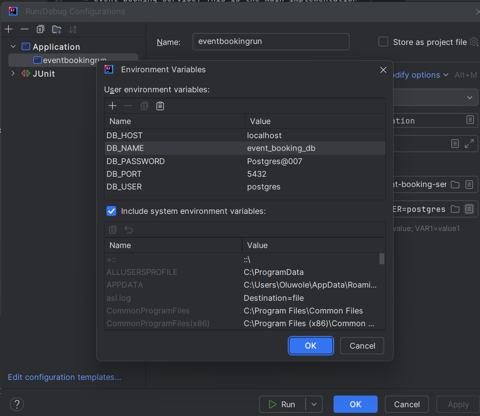

# event-booking-service

# Getting started
There are two projects in the `event-booking` folder. 
* `event-booking-contract`: This is a Maven project containing the 
YAML file defining all the endpoints in the project. It 
consists of the original file shared and the modifications 
I made. I scaffolded the endpoints using 
`openapi-generator-maven-plugin`. Note that this project 
must be built first before the service project as it is a 
required dependency. Navigate into the project and execute 
`mvn clean install` to build the project.

* event-booking-service: This is the main implementation 
implementing the scaffolded endpoints. To start the project 
successfully, there is a `docker-compose` file that 
contains a Docker container housing the Postgres database 
used by the service. Ensure that Docker is running on your 
machine and then, from your command line or IDE terminal,
navigate into the root of the project and run `docker 
compose up`. This will create a Docker container to be 
used during the runtime of the service. To stop the 
container at any time, run `docker compose down`. The 
container creates a database called `event_booking_db`.

# Tables initialization
Liquibase generates the database tables from the database
scripts when you run the service. 

# Starting the service
To run the service, I have created a run configuration 
that defines the environment variables used in the 
service. See screenshot below. Feel free to adjust 
however you like.

# Unfinished tasks
To do:
- notifications scheduling.
- add unit tests

